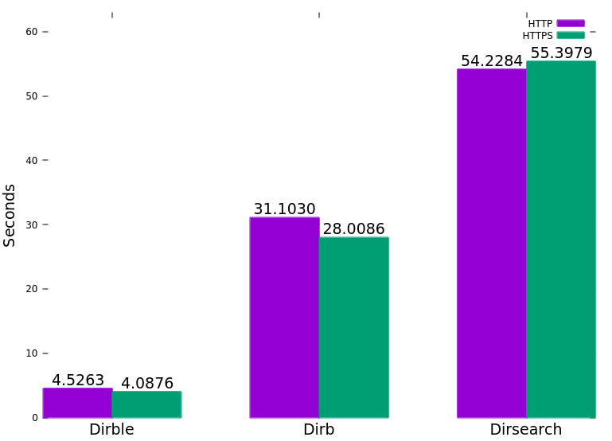

# Introduction

Dirble is a website directory scanning tool for Windows and Linux. It's designed to be fast to run and easy to use.

# How to Use

Download one of the [precompiled binaries](https://github.com/nccgroup/dirble/releases/latest) for Linux, Windows, or Mac, or compile the source using Cargo, then run it from a terminal. The default wordlist Dirble uses is dirble_wordlist.txt in the same directory as the executable.

There is also a docker image, which can be run as:
`docker run --rm -t isona/dirble [dirble arguments]`

# Example Uses

Run against a website using the default dirble_wordlist.txt from the current directory:
`dirble [address]`

Run with a different wordlist and including .php and .html extensions:
`dirble [address] -w example_wordlist.txt -x .php,.html`

With listable directory scraping enabled:
`dirble [address] --scrape-listable`

Providing a list of extensions and a list of hosts:
`dirble [address] -X wordlists/web.lst -U hostlist.txt`

Providing multiple hosts to scan via command line:
`dirble [address] -u [address] -u [address]`

Running with threading in Gobuster's default style, disabling recursion and having 10 threads scanning the main directory:
`dirble [address] --max-threads 10 --wordlist-split 10 -r`

# Building from source

To build on your current platform, ensure cargo is installed and then run `cargo build --release`. Alternatively, running `make` will build the binary in release mode (internally running `cargo build --release`).

To cross-compile for 32- and 64-bit Linux and Windows targets, there is a handy makefile. `make release` will build for all four targets using `cross`. This depends on having cross and docker installed (`cargo install cross`).

# Features

* Cookies
* Custom Headers
* Extensions and prefixes
* HTTP basic auth
* Listable directory detection and scraping
* Save ouptut to file
* Save output in XML and JSON formats
* Proxy support
* Recursion
* Status code blacklisting and whitelisting
* Threading
* Request throttling
* Detect not found code of each directory based on response code and length
* Ability to provide list of URLs to be scanned
* User agents
* Scanning with GET, POST or HEAD requests
* Exclude ranges of response lengths from output

# Performance

The following graph was generated by running each tool with Hyperfine against a test server with 5ms latency and 1% packet loss. (Gobuster was omitted due to lack of recursion).

# How it works

## Directory Detection

Dirble detects files based on the response code sent by the server. The behaviour can be loosely categorised by response code type.
* `200`: the path exists and is valid
* `301, 302`: redirection; report the code, size, and Location header
* `404`: not found; by default these responses are not reported
* All other response codes are reported in the Dirble format of `+ [url] (CODE:[code]|SIZE:[size])`

A path is classified as a *directory* if a request to `[url]` (with *no* trailing slash) returns a 301 or 302 redirection to `[url]/` (*with* a trailing slash). This gets reported with a `D` prefix and if recursion is enabled will be added to the scan queue. 
This method is not dependent on the redirection target existing or being accessible, so a separate request will be made to determine the response code and size of the directory.

Listable directories are detected by inspecting the content of `url/`: if it returns a 200 response code and the body contains either "parent directory", "up to " or "directory listing for" (case insensitive), then it is likely to be a listable directory. If `--scrape-listable` is enabled, URLs are parsed out of the listing (ignoring sorting links or out of scope links) and added to the scan queue if they have a trailing slash. Listable directories have an `L` prefix in the output.

## Threading
The threading behaviour of Dirble is based on the concepts of *wordlists* and *jobs*. A *job* is any task which can be run independently of other tasks, for example requesting a series of URLs. A *wordlist* is a list of words with a defined transformation, for example the list `{admin, config, shop}` together with the transformation `append ".php"` forms a single wordlist instance.

To improve performance further, we introduce the concept of *wordlist splitting*. This is the process by which a single *wordlist* instance (*i.e.* words with a transformation) is broken up into multiple jobs, each responsible for a portion of the list. The number of interleaved portions that each wordlist is split into is defined by the `--wordlist-split` option (default 3).

Whenever a directory is detected (and recursion is enabled) new jobs are created for each split wordlist (with transformation) and added to a central *job queue*.

The maximum number of concurrent tasks is defined by the `--max-threads` parameter, and Dirble will start jobs as they are added to the queue, up to this limit. Whenever a job completes (*i.e.* a split wordlist is exhausted) Dirble will take the next job from the queue and start it.

Released under GPL v3.0, see LICENSE for more information
